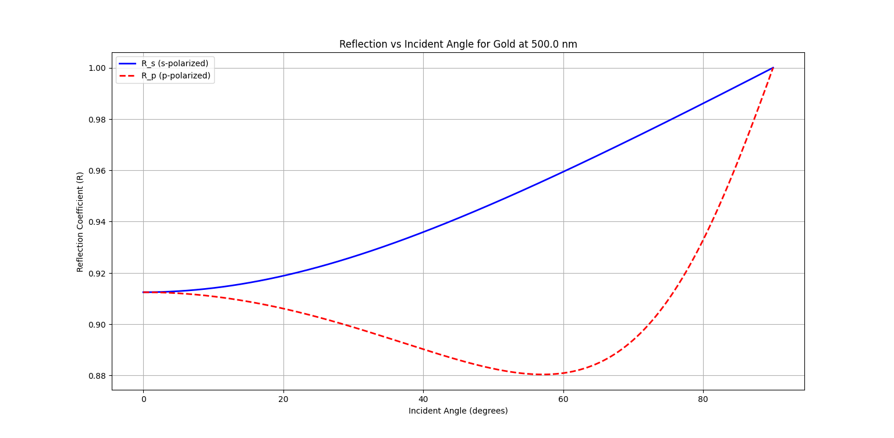

# light-metal-simulation
A simple Python simulation to study how visible light interacts with metallic surfaces at normal or oblique angles of incidence.

### 💡 Features
- Uses Drude model to compute complex dielectric function
- Calculates Fresnel reflection coefficients (R_s and R_p)
- Supports 5 common metals + custom input
- Plots reflection vs. incident angle
- User-friendly CLI with input validation

### 🔧 Requirements
- Python 3.x
- `numpy`, `matplotlib`

Install via pip:
```bash
pip install numpy matplotlib

### 📈 Sample Output

